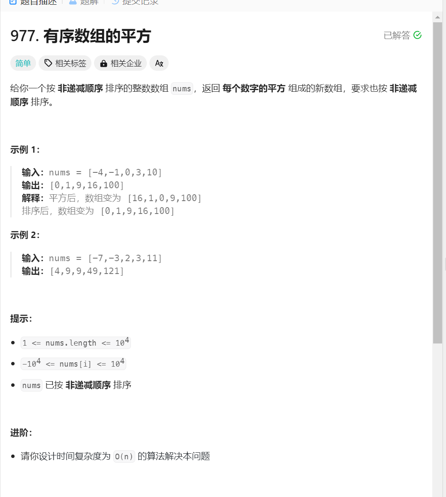

# 有序数组的平方
1. 题目描述:

2. 思路1: 利用暴力求解,首先利用一个循环把数组中的每一个元素分别平方,之后可以利用快速排序进行排序,时间复杂度为O(n+nlog n)
3. 思路二: 可以利用双指针法,注意双指针法只是针对不同状态进行处理,优势就是可以最大程度上遍历数组,本题中也是一样,由于数组有序,所以最大或者最小值只有可能出现在数组的前面或者后面,所以可以让一个指针指向数组的最前面,一个指针指向数组的最后面,另外一个指针指向新数组的最前面,通过移动比较前面和后面元素的大小实现新数组中元素的赋值
4. 代码实现:
```java
class Solution {
    public int[] sortedSquares(int[] nums) {
        // 还是可以利用双指针法进行排序,就是可以定义分别指向别一个数组的指针
        // 只不过这一次没有快慢指针之分
        // 首先定义一个数组
        // 要降低时间复杂度就要牺牲空间复杂度
        int l = nums.length;
        int[] result = new int[l];
        int i = 0, j = l - 1;
        for (int k = l - 1; k >= 0; k--) {
            if (nums[i] * nums[i] < nums[j] * nums[j]) {
                result[k] = nums[j] * nums[j];
                j--;
            } else {
                result[k] = nums[i] * nums[i];
                i++;
            }
        }
        return result;
    }
}
```
