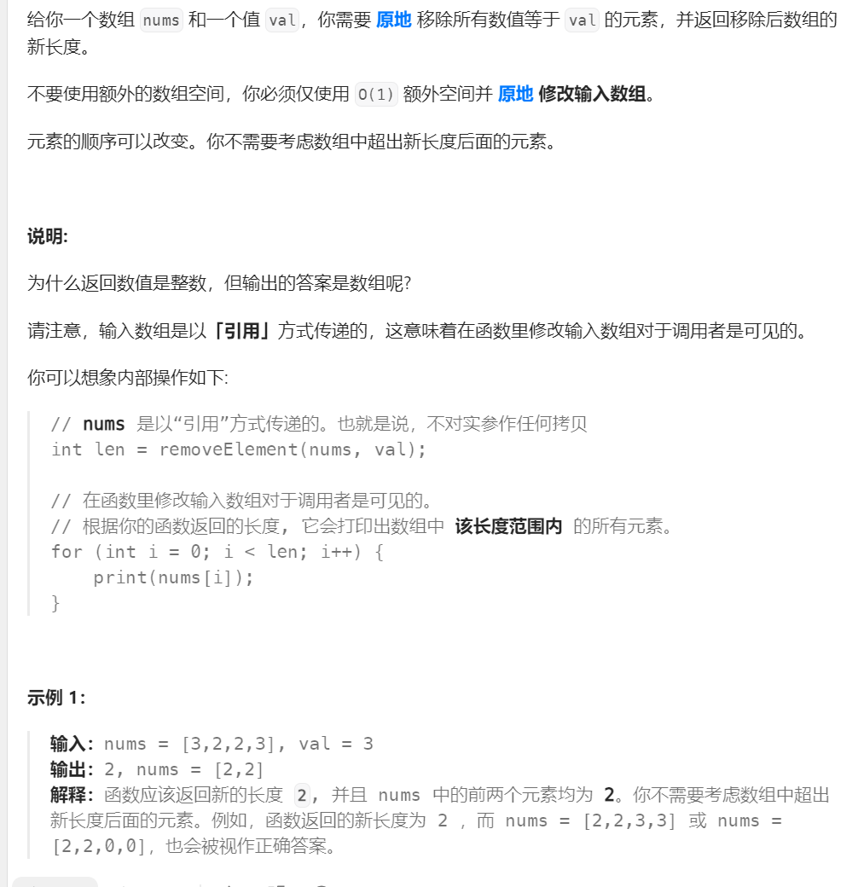
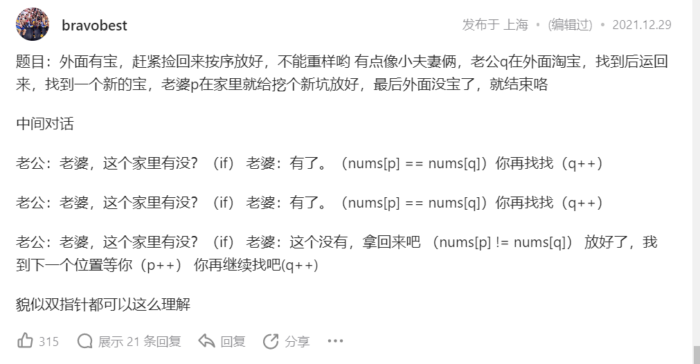
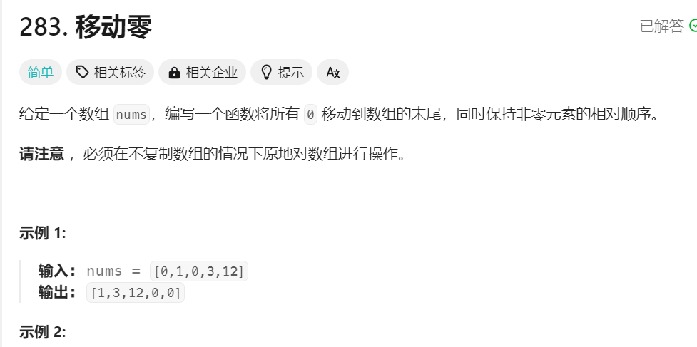

# 数组中元素的移除
1. 由于数组在内存上是连续的,所以不可以中途删除某一个元素,数组中删除元素的方法要么用后面的元素覆盖前面的元素,要么把元素交换到后面去(最后进行len--)
2. 把要移除的元素放在最后的另外一个思路:首先定义一个变量temp记录要移除的元素的值,之后把后面的元素顺次前移,在把最后一个元素赋值为temp即可
3. 题目表述:

### 方式一: 暴力求解
1. 首先必须一次循环遍历一次数组,遍历的过程中,遇到与目标值相同的元素要进行删除(由于不要求元素的顺序,可以利用覆盖法删除元素),就是让后面的不断覆盖前面的数
2. 小细节: 每一次循环结束之后,被移除的元素就不要在关心了,直接nums.length--,就相当于减少了元素,但是还是要从之前扫描元素的下一个元素开始扫描就可以把当前索引--
3. 代码实现:
```java
class Solution {
    public int removeElement(int[] nums, int val) {
        // 可以利用一个数字不断记录上一个整数值2的位置
        int l = nums.length;
        for (int i = 0; i < l; i++) {
            if (nums[i] == val) {

                for (int j = i + 1; j < l; j++) {
                    nums[j - 1] = nums[j];
                }
                i--; // 还是要从当前索引处元素的下一个元素开始扫描
                l--; // 数组长度--才算是彻底减少了元素
            }
        }
        return l;
    }
}
```
### 方法二: 双指针法
1. 实现的思路:首先定义一个快指针,用于存储要存放在新数组中的元素(就是不适合目标元素相同的元素),另外一个是慢指针用于指示删除元素的下标
2. 这样把快指针指向的数组赋值给慢指针对应的索引就可以了
3. 就相当于fast指针的作用就是找到要添加的元素,慢指针遇到删除元素就要停下来赋值
4. 代码实现:
```java
class Solution {
    public int removeElement(int[] nums, int val) {
        int slow=0;
        for(int fast=0;fast<nums.length;fast++){
            if(nums[fast]!=val){
                nums[slow]=nums[fast];
                slow++;
            }
        }
        return slow;
    }
}
```
## 变式二:
1. 题目表述:

2. 思路: 还是利用双指针,就是一个指针用于遍历元素,当元素满足要求是就可以移动另外一个指针,进行赋值处理
3. 代码实现
```java
class Solution {
    public int removeDuplicates(int[] nums) {
        // 还是利用双指针的思路做题
        if (nums == null || nums.length == 0)
            return 0;
        int slow = 0;
        for (int fast = 1; fast < nums.length; fast++) {
            if (nums[fast] != nums[slow]) {
                if (fast - slow > 1) {
                    nums[slow + 1] = nums[fast]; // 防止把自己赋值给自己
                }
                slow++;

            }
        }
        return slow + 1;
    }

}
```
4. 看到一个形象的比喻:

### 变式二: 移动零
1. 题目表述:

2. 类似双指针的题目就是用于数组元素的移除,题目不同,就是对双指针的处理策略不同而已
2. 代码实现:
```java
class Solution {
    public void moveZeroes(int[] nums) {
        int slow = 0;
        for (int fast = 0; fast < nums.length; fast++) {
            if (nums[fast] != 0) {
                // 交换操作
                int temp = nums[fast];
                nums[fast] = nums[slow];
                nums[slow] = temp;
                slow++;
            }
        }
    }
}
```


