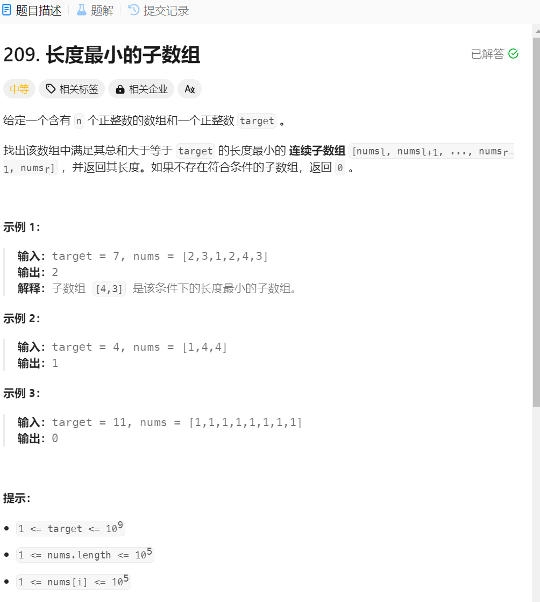
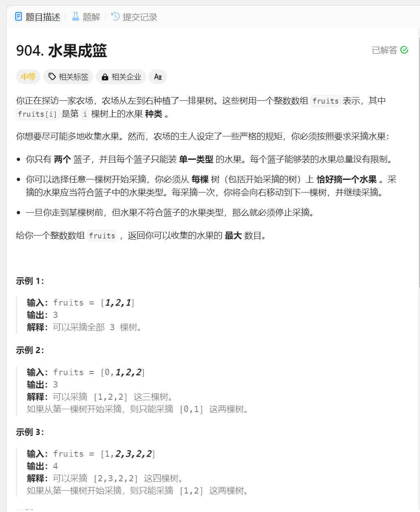

# 查找最小满足要求的最小长度的一个数组
1. 题目描述:

2. 思路:可以利用滑动窗口的思想进行解题,滑动窗口其实还是双指针,只是关注的是双指针之间的元素,当元素满足条件时,就是进一步缩小条件,判断是否满足,直到得到最优条件为止
3. 细节: 判断的构成中应该使用while判断,如果只是使用if判断,其实为止只可以移动一次(if判断可以利用三目运算符号表示)
4. 代码演示:
```java
class Solution {
    public int minSubArrayLen(int target, int[] nums) {
        // 利用滑动窗口,最重要的还是起始位置的移动时机
        int l = nums.length;
        int min = l + 1;
        int i = 0; // 起始位置
        int sum = 0;
        for (int j = 0; j < l; j++) {
            sum += nums[j];
            while (sum >= target) {
                int newMin = j - i + 1;
                if (newMin < min) {
                    min = newMin;
                }
                i++;
                sum -= nums[i - 1];
            }
        }
        if (min == l + 1) {
            return 0;
        }
        return min;
    }
}
```
### 变式题二: 采摘水果问题
1. 题目描述:

2. 题目的分析:首先还是在一个集合中寻找元素,并且搜寻对象还是一个区间,所以可以使用滑动窗口法,另外一个难点就是如何记录出现的元素呢,这里可以使用Map集合进行处理
3. 思路:其实滑动窗口的作用还是要得到所有满足条件的区间,但是相对于遍历来说,滑动窗口找到的区间都是满足条件的极限情况,就是如果两个指针之间的区间满足条件,还要改变起始位置的值,之后不断判断,缩小区间
4. 实现1: 可以利用HashMap记录元素种类的个数(也可以用一个数组存储)
5. 代码实现:
```java
class Solution {
    public int totalFruit(int[] fruits) {
        // 还是要使用滑动窗口的思想
        // 1. 此时的终止条件就是窗口中的元素数量小于或者等于2(也就是满足条件就可以记录了)
        // 2. 其实就是利用两个指针确定一个滑动的区间,之后记录满足要求的区间长度就可以了
        // 3. 数据的统计就可以使用Map集合
        Map<Integer, Integer> cnt = new HashMap<>(); // 定义一个集合用于记录滑动区间内元素的个数
        int i = 0; // 起始位置
        int max = 0;
        for (int j = 0; j < fruits.length; j++) {
            cnt.put(fruits[j], cnt.getOrDefault(fruits[j], 0) + 1); // 就是用内置函数记录出现的个数,内置函数可以等效成两个条件判断
            while (cnt.size() > 2) {
                // 就是可以开始移动起始位置,缩小搜索范围了
                cnt.put(fruits[i], cnt.get(fruits[i]) - 1); // 就是利用集合中元素的覆盖性
                if (cnt.get(fruits[i]) == 0) {
                    // 就可以删除这一种水果了
                    cnt.remove(fruits[i]);
                }
                i++; // 移动起始位置
            }
            // 得到的区间就是满足要求的区间
            max = Math.max(max, j - i + 1);
        }
        return max;
    }
}
```
### 变式三: 
