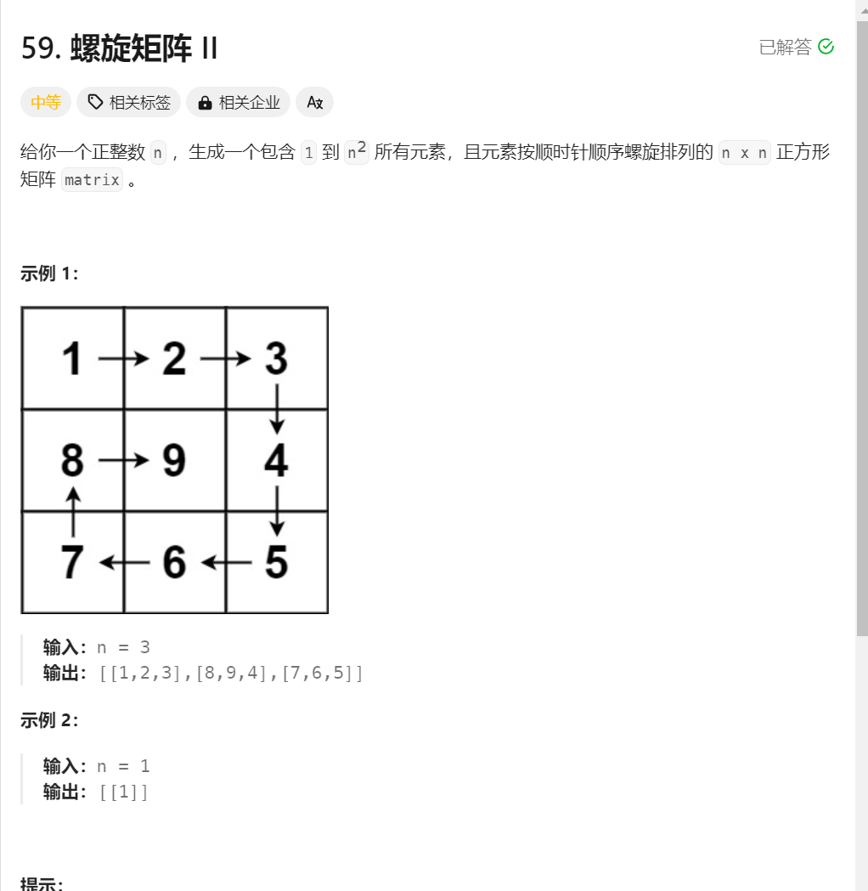

# 生成螺旋数组
1. 题目描述：

2. 题目分析:
   1. 还是循环不变量的原则,每一次遍历总是遵循左开右闭的规则,遍历的顺序 上 右 下 左
   2. 注意每一次的起点,可以用一个变量start接受 ,所以每一次遍历的范围都是[start, n-loop)
   3. 如果是奇数,由于区间的开闭性,中间的数字没有赋值,所以应该单独赋值
3. 代码演示:
```java
class Solution {
    public int[][] generateMatrix(int n) {
        int loop = 0;  // 控制循环次数
        int[][] res = new int[n][n];
        int start = 0;  // 每次循环的开始点(start, start)
        int count = 1;  // 定义填充数字
        int i, j;

        while (loop++ < n / 2) { // 判断边界后，loop从1开始
            // 模拟上侧从左到右
            for (j = start; j < n - loop; j++) {
                res[start][j] = count++;
            }

            // 模拟右侧从上到下
            for (i = start; i < n - loop; i++) {
                res[i][j] = count++;
            }

            // 模拟下侧从右到左
            for (; j >= loop; j--) {  // 还是要注意每一次的循环条件, 遍历的区间总是左开 [start,n-loop)
                res[i][j] = count++;
            }

            // 模拟左侧从下到上
            for (; i >= loop; i--) {
                res[i][j] = count++;
            }
            start++;
        }

        if (n % 2 == 1) {
            res[start][start] = count;
        }

        return res;
    }
}
```
