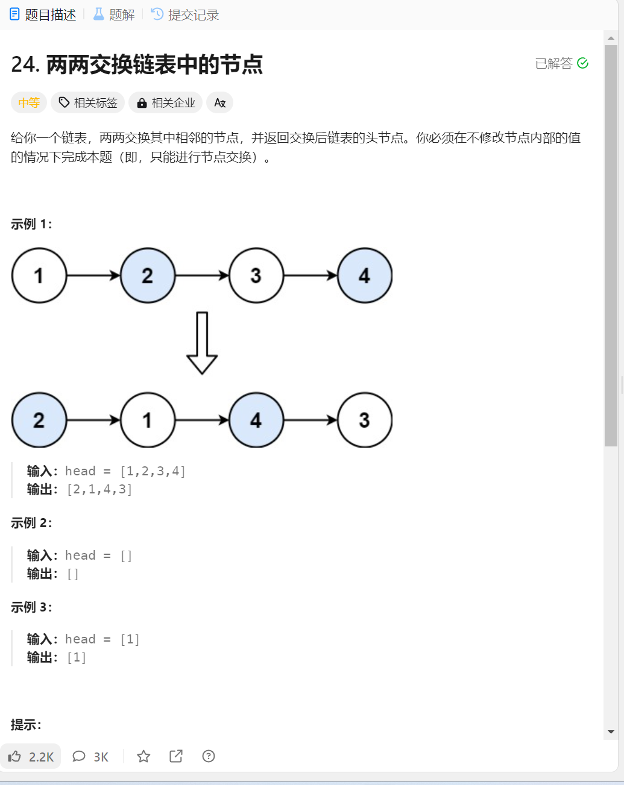
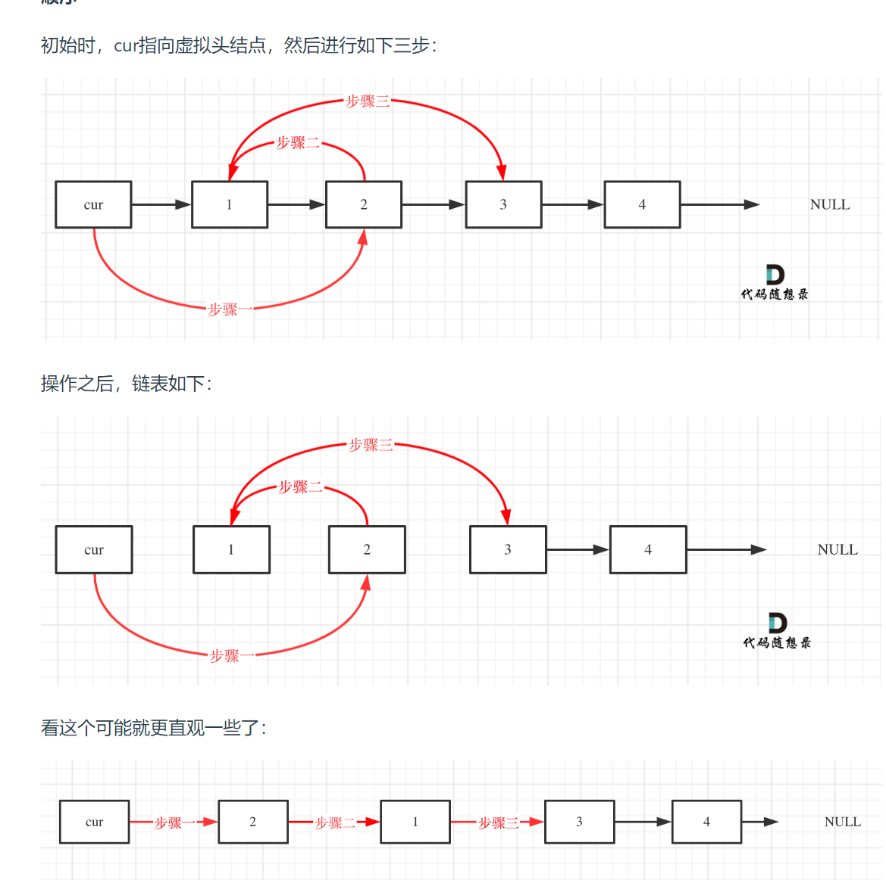

# 交换链表节点
1. 题目描述:

### 思路分析:
#### 方法一: 迭代求解
1. 还是定义一个虚拟头节点
2. 利用简单模拟的方法,其实就是把每两个节点之间的指向逆转,这里可以用这两个节点之前的一个节点,之后通过调整这三个节点之间的关系即可
3. 细节: 就是注意调整的顺序(假设这里的虚拟头节点为dimHead,则调整顺序为dimHead->2 之后 2->1, 最后 1->3但是直接这样做的话,无法通过2找到3所以要存储对应的节点(1,2,3对应的节点都要存储))(再就是注意终止条件,终止条件就是要考虑奇数还是偶数之后取并集)
4. 实现步骤:

5. 代码实现:
```java
class Solution {
  public ListNode swapPairs(ListNode head) {
        ListNode dumyhead = new ListNode(-1); // 设置一个虚拟头结点
        dumyhead.next = head; // 将虚拟头结点指向head，这样方便后面做删除操作
        ListNode cur = dumyhead;
        ListNode temp; // 临时节点，保存两个节点后面的节点
        ListNode firstnode; // 临时节点，保存两个节点之中的第一个节点
        ListNode secondnode; // 临时节点，保存两个节点之中的第二个节点
        while (cur.next != null && cur.next.next != null) {
            temp = cur.next.next.next;
            firstnode = cur.next;
            secondnode = cur.next.next;
            cur.next = secondnode;       // 步骤一
            secondnode.next = firstnode; // 步骤二
            firstnode.next = temp;      // 步骤三
            cur = firstnode; // cur移动，准备下一轮交换，为什么要移动到这里来，因为cur节点本来就要指向带移动的两个节点的前方,这里firstnode.next已经赋值给了temp了
        }
        return dumyhead.next;  
    }
}
```
#### 思路二: 递归方法
1. 其实双指针迭代的方法都可以写成递归的形式,可以把头节点和头节点之后的节点单独拿出来,使用递归排好之后的节点,之后调整头节点和头节点之后的节点和已经排好的节点的头节点之间的关系
2. 细节: 注意递归一定要有边缘条件的判断,否则递归不会停止后一直进行,最后返回的也不一定是头节点
3. 代码实现:
```java
// 递归版本
class Solution {
    public ListNode swapPairs(ListNode head) {
        // base case 退出提交
        if(head == null || head.next == null) return head;
        // 获取当前节点的下一个节点
        ListNode next = head.next;
        // 进行递归
        ListNode newNode = swapPairs(next.next);
        // 这里进行交换
        next.next = head;
        head.next = newNode;

        return next;
    }
} 
```

