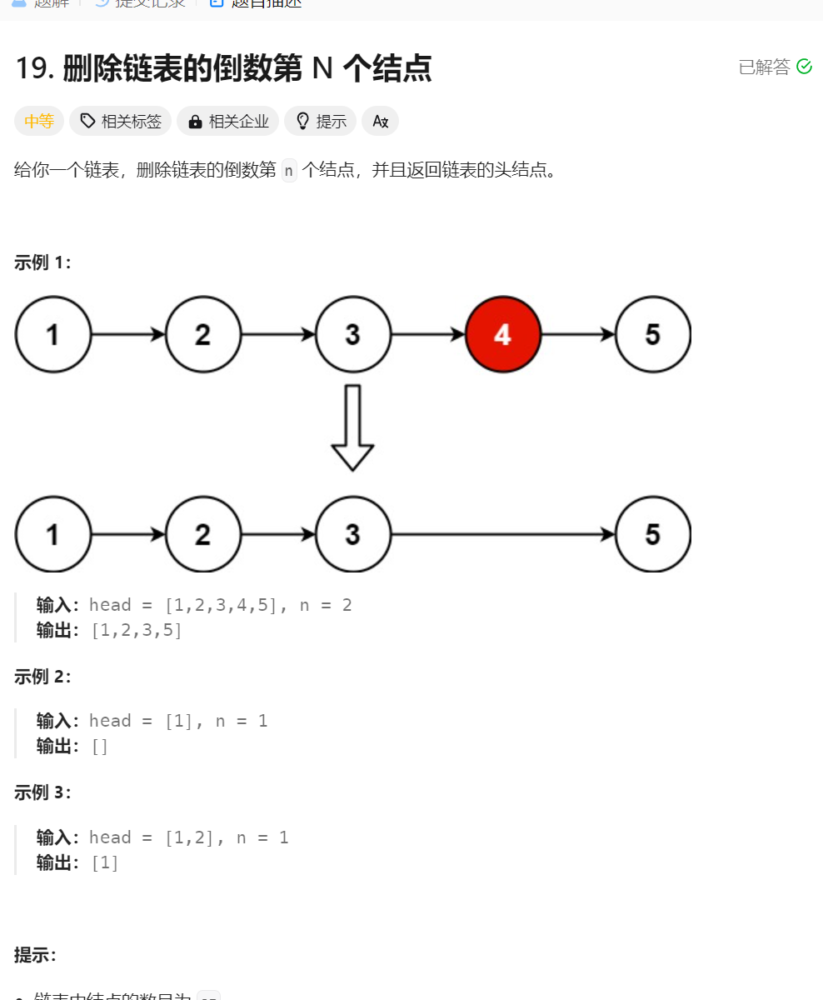
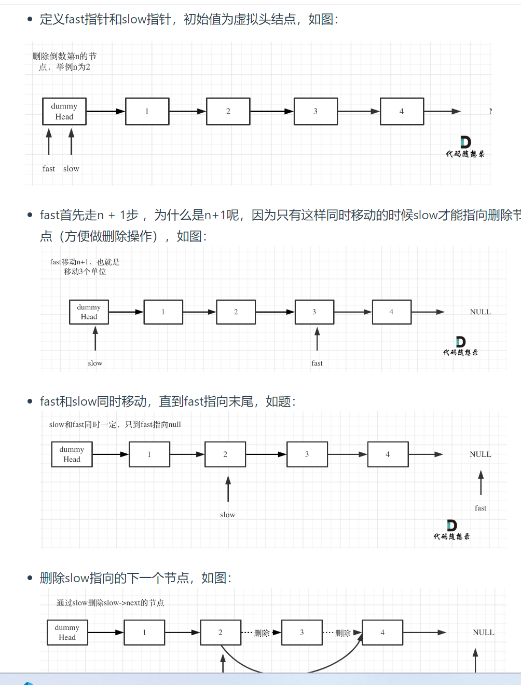

# 删除链表中倒数第n个元素
1. 题目描述:

2. 思路分析(快慢指针法):还是神奇的快慢指针法,就是利用两个指针的步数之差确定倒数第n个节点
3. 模拟步骤: 首先fast指针先走n+1步,之后fast指针和slow指针一起走,由于本来之间就差了n+1个元素,所以当fast走向null时,slow就走向了倒数第n个元素前面的节点
4. 细节:还是需要一个虚拟头节点,一旦有了虚拟头节点,最后函数返回的值就是dimHead.next,不是head,因为head在内存地址上面没有变化(一定要记住这一点)
5. 画图分析:

6. 代码实现:
```java
class Solution {
    public ListNode removeNthFromEnd(ListNode head, int n) {
        // 其实就是数学技巧,如何找到倒数第n个节点
        ListNode dimHead = new ListNode(-1, head);
        ListNode fast = dimHead;
        ListNode slow = dimHead;
        // 首先fast 走n+1步
        for (int i = 0; i < n + 1; i++) {
            fast = fast.next;
        }

        while (fast != null) {
            slow = slow.next;
            fast = fast.next;
        }
        // 开始删除节点即可
        // 其实就是删除slow之后的一个节点即可
        slow.next = slow.next.next;
        return dimHead.next;

    }
}
```
