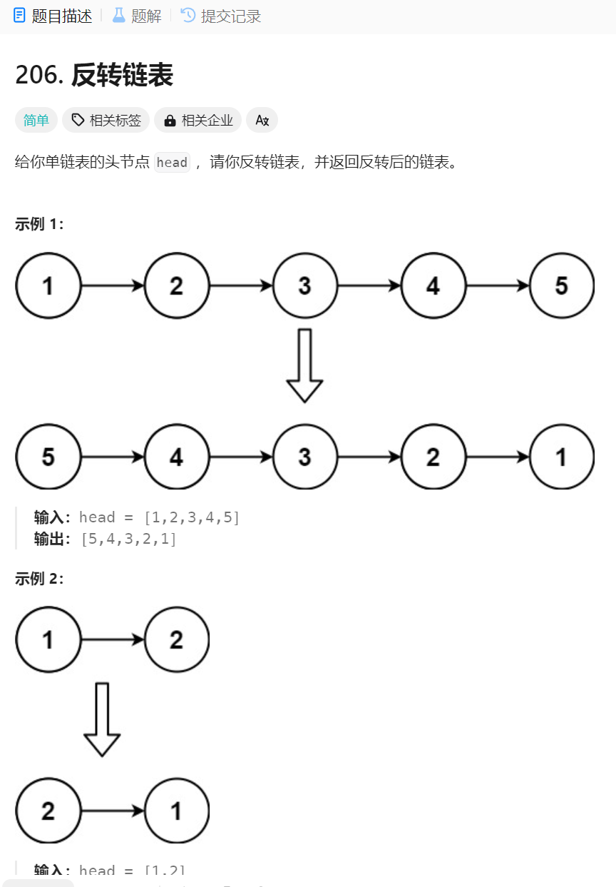

# 反转链表
1. 题目描述:

2. 思路整理:
### 思路1(暴力求解)
1. 首先可以把链表中的元素都存储在一个集合ArrayList中,之后反向遍历集合,依次把集合中的元素存储在链表中,返回链表的头节点即可
2. 代码演示: 略
### 思路2(双指针法)
1. 反转链表其实就是该表指针的指向,可以定义两个指针,一个走在后面,一个走在前面,之后就可以不断破除两个节点之间的联系,建立新的联系
2. 小细节: 每一次移动要存储下一次移动到的位置,每一次都是改变指针指向的操作
3. 代码实现:
```java
// 双指针
class Solution {
    public ListNode reverseList(ListNode head) {
        ListNode prev = null;
        ListNode cur = head;
        ListNode temp = null;
        while (cur != null) {
            temp = cur.next;// 保存下一个节点
            cur.next = prev;
            prev = cur;
            cur = temp;
        }
        return prev;
    }
}
```
### 思路3(递归)
1. 思路分析: 其实就是改变指针的指向,改变之后指针的指向之后只用改变头指针和之后的一个节点的指向就可以了
2. 细节分析: 注意递归的边界条件,条件越接近普遍条件,递归的次数就会越少,另外就是注意头节点之后的指针的变动(头节点可以变成为节点,head.next=null即可)(还有逆转的一块和头节点之间的关系，原来指向null,之后要指向head)
3. 代码实现:
```java
// 从后向前递归
class Solution {
    ListNode reverseList(ListNode head) {
        // 边缘条件判断
        if(head == null) return null;
        if (head.next == null) return head;
        
        // 递归调用，翻转第二个节点开始往后的链表
        ListNode last = reverseList(head.next);
        // 翻转头节点与第二个节点的指向
        head.next.next = head;
        // 此时的 head 节点为尾节点，next 需要指向 NULL
        head.next = null;
        return last;
    } 
}
```
利用双指针的方式递归(就和双指针的算法类似)
```java
// 递归 
class Solution {
    public ListNode reverseList(ListNode head) {
        return reverse(null, head);
    }

    private ListNode reverse(ListNode prev, ListNode cur) {
        if (cur == null) {
            return prev;
        }
        ListNode temp = null;
        temp = cur.next;// 先保存下一个节点
        cur.next = prev;// 反转
        // 更新prev、cur位置
        // prev = cur;
        // cur = temp;
        return reverse(cur, temp);
    }
}
```


