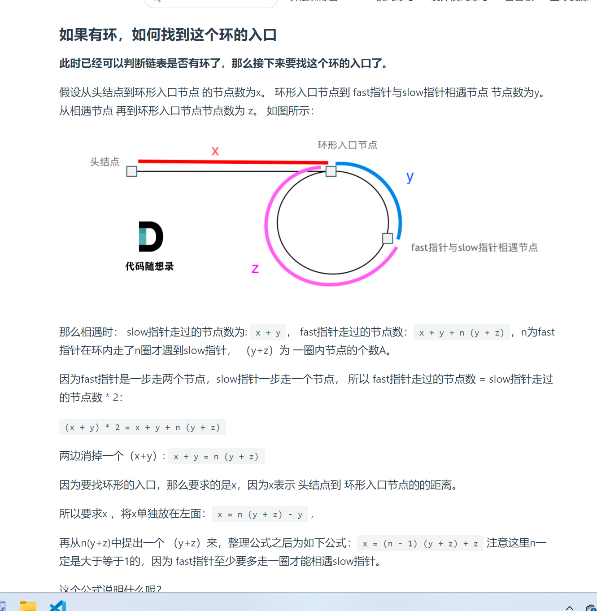

# 环形链表
1. 题目描述:

2. 思路(快慢指针法): 可以定义一个快指针,定义一个慢指针,快指针每一次走两步,慢指针每一次走一步,如果快慢指针相遇就说明有环,两外记录一下快慢指针的相遇点,定义一个指针指向这个相遇点,定义一个起始指针指向头节点,两个指针同时出发,得到的就是如环点
3. 细节分析:
   1. 为什么这里快指针的速度要比慢指针的速度快1?   因为这样的话在环中相对速度就是1,快指针一定可以追上慢指针
   2. 为什么之后要定义两个指针重新走，找到的相遇点就是入环点,推到如下:


4. 最后就是循环结束条件: head.next!=null&&head!=null,使用这个就可以了,避免了循环之外的条件判断
5. 代码演示:
```java
public class Solution {
    public ListNode detectCycle(ListNode head) {
        // 还是利用快慢指针的思想
        // 快指针每一次会走2步,慢指针每一次会走一步,经过理论推导最后他们可以在出口处相遇
        ListNode slow = head;
        ListNode fast = head;

        while (fast != null && fast.next != null) {
            fast = fast.next.next;
            slow = slow.next;
            // 否则就是有环
            if (fast == slow) {
                ListNode temp = head;
                ListNode target = fast;

                while (temp != target) {
                    temp = temp.next;
                    target = target.next;

                }
                return temp;
            }

        }
        return null;

    }
}
```