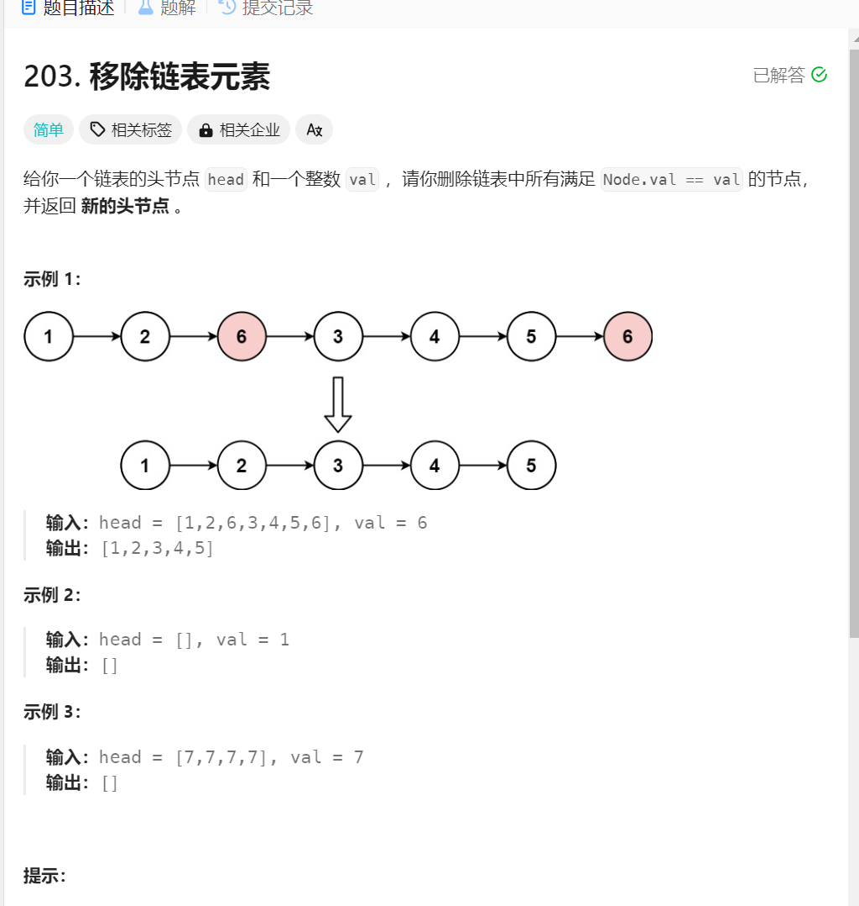

# 移除链表中的元素
1. 题目描述:

2. 思路1: 就是正常的移除元素的思路,删除元素分为两种情况:
   1. 如果要删除头指针,就可以把头指针向后面移动, head=head.next
   2. 如果不是删除头指针,而是删除某一个指针之后的指针,可以利用cur.next=cur.next.next就可以了
3. 思路1细节:
   1. if还是while:if就是判断一次,操作一次,但是while是反复判断,反复操作元素,持续删除元素
   2. 条件判断中的条件: 只用保证要取出元素的指针不是空指针,不要对空指针进行操作就可以了
4. 代码实现:
```java
class Solution {
    public ListNode removeElements(ListNode head, int val) {
        while(head!=null && head.val==val){  // 首先判断头节点是否为空,注意这里使用while,达到持续删除的作用
        head = head.next;
    }
    ListNode curr = head; 
    while(curr!=null){   // 这里不用考虑是不是尾节点,之后会判断
        while(curr.next!=null && curr.next.val == val){ // 如果不是头节点的删除方式
            curr.next = curr.next.next; // 还是持续删除 
             // 判断条件只用保证 cur.next!=null应为null.val会报错
        }
        curr = curr.next; // 后移动
    }
    return head;

    }
}
```
5. 思路2: 虚拟头节点,就是只用设置一个没有意义的头节点,开始遍历链表,进行元素的删除就可以了,这种情况下,所有元素的删除操作一致
6. 细节: 最后的返回值是dimHead.next,原因就是操作的是dimHead开头的链表,所以一定要和这个相关
7. 代码实现1:
```java
class Solution {
    public ListNode removeElements(ListNode head, int val) {

        ListNode dimHead = new ListNode(0, head);
        ListNode cur = dimHead;
        while (cur != null) {
            while (cur.next != null && cur.next.val == val) {
                cur.next = cur.next.next;
            }
            cur = cur.next;
        }
        return dimHead.next; // 操作的永远都是头节点,被删除的节点没有意义
    }
}
```
1. 代码实现2:
```java
class Solution {
    public ListNode removeElements(ListNode head, int val) {

        ListNode dimHead = new ListNode(0, head);
        ListNode cur = dimHead.next;
        ListNode pre = dimHead;
        while (cur != null) {
            if (cur.val == val) {
                pre.next = cur.next;
            } else {
                pre = cur; // 防止链表中的元素遗漏
            }
            // 用while的话不好移动
            cur = cur.next;

        }
        return dimHead.next; // 注意返回的值是什么

    }
}
```


